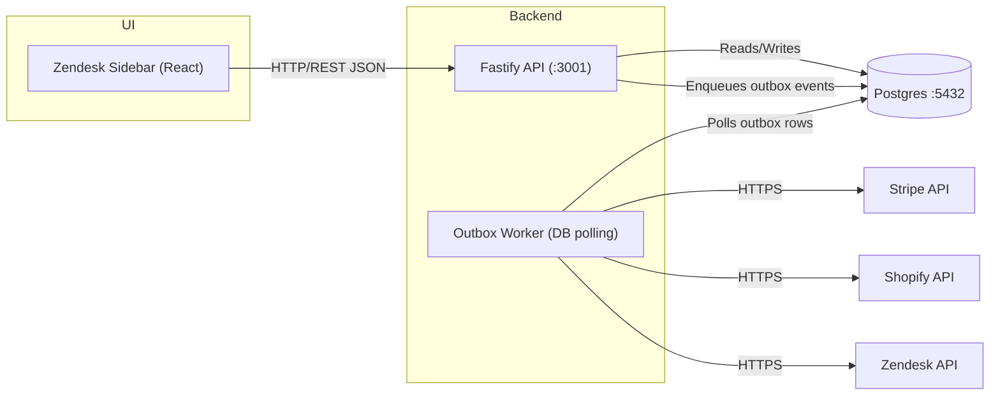

# ARCHITECTURE

High-level architecture for `support-overlay`: a Zendesk sidebar UI, a Fastify
API, a DB-backed outbox worker, PostgreSQL persistence, and provider connectors.

## Components

- **Zendesk Sidebar** (`apps/sidebar`): React UI for agent-facing resolution
  workflows. Currently a standalone Vite app with a scenario picker, not yet a
  installed Zendesk app — there is no ZAF manifest.
- **Backend API** (`apps/api`): REST endpoints, policy evaluation, approval
  orchestration, persistence.
- **Outbox Worker** (`apps/api/src/worker.ts`): a separate process that shares
  the API's service layer. Claims pending outbox rows and executes provider
  calls under per-action retry classification with effects-ledger dedupe.
- **PostgreSQL**: source of truth for issues, evidence, approvals, outbox, and
  the immutable audit log.
- **Connectors** (`packages/connectors`): adapters for Zendesk, Stripe, and
  Shopify. They classify failures — `TimeoutError`, `PermanentError`, or
  retriable — which is what lets the worker apply the right policy per action.
- **Shared vocabulary** (`packages/shared`): the single source of enums, action
  types, retry classes, and error types. No other module may redefine these.

## Data Flows And Ports

- Sidebar -> API: HTTP/REST JSON (default API port: `3001`).
- API <-> PostgreSQL: Postgres protocol (`5432`, host override via `POSTGRES_PORT`).
- API -> Outbox: transactional DB writes to `outbox_messages`.
- Worker -> Third parties: HTTPS calls to Zendesk, Stripe, and Shopify APIs.
- API -> Sidebar: polling-based card refresh (current design).

## Mermaid Diagram

## Exactly-once side effects

The core invariant: **one side effect per `effect_key`, ever.**

`effect_key` is deterministic — `executionId + effect_type + target_resource_id`
(plus a content hash where the payload matters). It is used three times over,
which is what makes the guarantee hold end to end:

1. As the Stripe `Idempotency-Key`, so a replayed request returns the original
   refund instead of creating a second one.
2. As `metadata.effect_key` on the refund, so reconciliation can determine
   whether *our* specific refund landed even when the response was lost.
3. As the effects-ledger dedupe key, so a re-claimed outbox row that finds a
   settled effect skips dispatch entirely.

### Outcome handling

| Outcome | Meaning | Action |
|---|---|---|
| `CONFIRMED` | Provider acknowledged | Mark sent; complete when all effects are sent |
| `FAILED_RETRIABLE` | Transient failure | Backoff and retry within the attempt budget |
| `FAILED_TERMINAL` | Provider rejected it | Stop. No `state_transitions` row is written |
| `SENT_UNCERTAIN` | Request sent, no response | Resolve by retry class — never by blind retry |

`SENT_UNCERTAIN` is the case that matters. For `OPERATOR_RETRY_ONLY` actions
(money movement) the worker reads provider state to see whether the effect
landed; if it did, that is a confirmation, and if it cannot be confirmed the
execution parks in `BLOCKED_OPERATOR` for a human. It is never re-sent.

`BLOCKED_OPERATOR` is deliberately distinct from `FAILED_TERMINAL`: one means
"we do not know", the other means "it definitively failed", and conflating them
in an audit trail is how a duplicate refund gets justified after the fact.

Reconciliation *appends* a `CONFIRMED` ledger entry rather than overwriting the
`SENT_UNCERTAIN` one — the fact that the outcome was once unknown is itself the
audit signal.

## Authentication

Tenancy is derived from the bearer credential, never from a request header.
Tokens are stored as SHA-256 hashes in `api_credentials`; each maps to one
tenant and one role (`agent`, `operator`, `webhook`). Approval endpoints take
the approving manager from the authenticated principal and check `manager_grants`.

Webhook signatures are verified over the **raw request body** using per-tenant
secrets from `tenant_integrations.webhook_secret`. There is no global fallback
secret: an unconfigured integration fails verification rather than trusting a
default.

## Diagram Notes

- The outbox pattern is used for safe side effects and retry handling.
- Secrets remain in runtime environment variables and are never committed.

## Artifacts

- Mermaid source: `docs/architecture.mmd`
- Rendered PNG: `docs/architecture-diagram.png`
- Demo GIF placeholder: `docs/demo-workflow.gif`
- Generation helper: `docs/generate-diagrams.sh`
